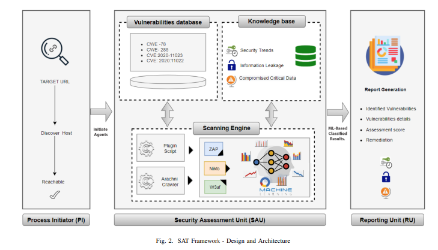
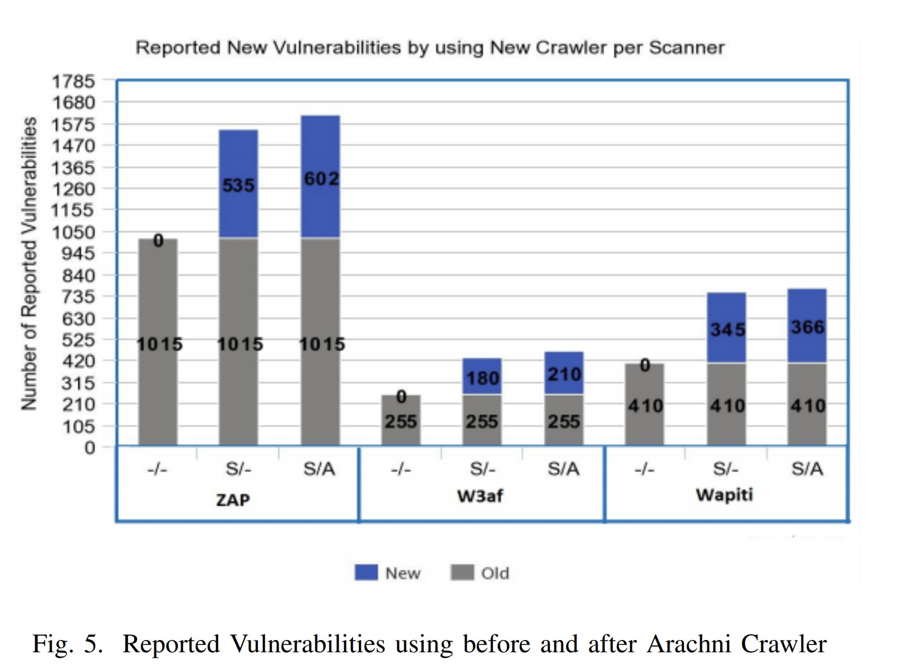
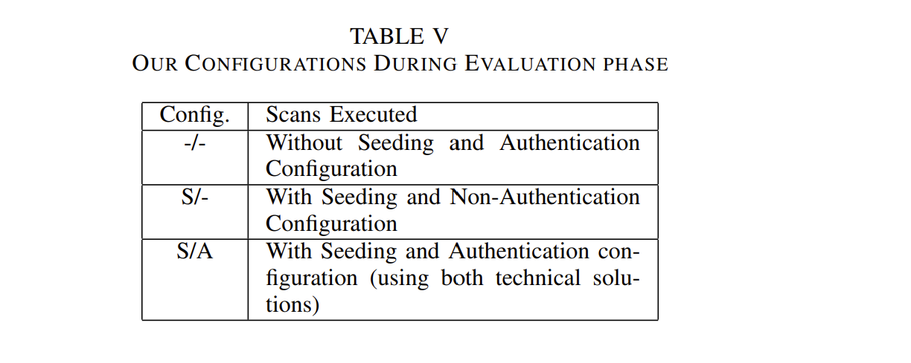

# SAT: Integrated Multi-agent Blackbox Security Assessment Tool using Machine Learning (March 2022)

| Resources	|
|----------|
| [Database](https://doi-org.ezproxy.semo.edu:2443/10.1109/ICAI55435.2022.9773750) |
| DOI: 10.1109/ICAI55435.2022.9773750 |
| [PDF](https://ieeexplore-ieee-org.ezproxy.semo.edu:2443/stamp/stamp.jsp?tp=&arnumber=9773750) 	|

----

### Goal: Evaluate publicly available web vulnerability scanners and propose an Integrated Multi-Agent Blackbox Security Assessment Tool (SAT)

**Goal 1:** Evaluation of publicly available web vulnerability scanners is performed against the top ten OWASP vulnerabilities and their performance is measured on the precision of their results

**Goal 2:** Proposed an Integrated Multi-Agent Blackbox Security Assessment Tool (SAT) for the security assessment of web applications

 

### Additional Notes

Changes in configuration settings are adequate to affix only 17% of vulnerabilities, most of those have a low severity level. 

On average, 33 vulnerabilities are found in each web application, among 6 of those are of high severity.

Examples of attacks: CSS, SQLi, remote code execution, file inclusion, XSS

Automated tools have to check every possible flaw in web app

Access Control flaws, hardcoded back-door, and identification of multi cover attack is **difficult** to detect and **harder** to detect with these tools

**Tool Assessment Parameters**
- [Quality of Crawling (QoC)](#qoc)
- [Quality of Fuzzing (QoF)](#qof)
- **Quality of Analyzing (QoA)**

**Precision Rate:** percentage of correctly detected vulnerabilities

**OAuth:** open standard used for access delegation and it is commonly used as a way for Internet users to grant access. 

**Effectiveness of a tool** depends upon its capability to efficiently crawl various web pages

 

----

 

## Approach
* Black-box
	- higher possibility scanner generates falsify detected vulnerabilities
	
**Use WIVET Crawler for increased coverage**

Used **Arachni crawler** for generating URL lists with the OAuth authentication framework. These URLs are provided as a seed value to other open-source scanners (ZAP, W3af, and Wapiti), and their vulnerabilities, detection have been improved.

 

## Tools

  

### SAT
- 

**Process Initiator (PI)**
	
Def: User input targeted URL in this module.
	
Use:  host discovery and initialization of the scanning process
	
Additional:
	
	Unreachable hosts are screened here and further process is terminated
	
**Security Assessment Unit (SAU)**
	
Def: performs scanning of the input web application
	
Subsections: 
- Scanning Engine: uses Arachni Crawler and provides features for custom plugin scripts
	- In mutual compliance with Zap, Nikto, and W3af
	- custom plugin scripts like OAuth, etc.
- Vulnerabilities database: contains a list of all possible vulnerabilities of OWASP top 10
- Knowledgebase
	- AI (Artificial Intelligence) based analysis engine
	- responsible to identify security trends, Information leakage and highlight compromised critical data of scanned organizations.
	
**Reporting Unit (RU)**: responsible for the generation of a detailed report that contains identified vulnerabilities (and the details, assessment score, and remediation of each)

  

**(Mentioned by other resources):**
- AppScan
- AWVS
- NetSparker
- Vega
- W3af
- Paros
- Wapiti
- Skipfish
- Nikto
- Wfuzz
- NetSparker
- HP web inspect
- Arachni
- OWASP Zed Attack Proxy (ZAP) - open-source crawler
- Havij
- Fimap
- Metasploit
- Acunetix
- Nexpose

**Mentioned**
- **WIVET (Web-Input Vector Extractor Teaser) version 4**: bench-marking project specifically designed to assess crawling coverage
	- tested Coverage when Seeded with WIVET Crawled Results
 

**Analyzed (Commercial Scanners):**
- [Acunetix](#acunetix): web vulnerability checker
- [HP web inspect](#hp-webinspect): launch attacks on web systems
- [NetSparker](#netsparker): web scanner to discover web vulnerabilities
- [AppScan](#appscan): centralized control with additional functionalities
- [Nessus](#nessus): detect vulnerabilities in OS, software patches, and services

 

**Analyzed (Open-Source Scanners):**
- [ZAP](#zap): web security assessment tool
- [Nikto](#nikto):
- [W3af](#w3af): Web Application Attack and Audit Framework
- [Wapiti](#wapiti): automate audit process
- [Arachni](#arachni):
- [Burpsuite](#burpsuite): pen testing toolkit

 

## Equipment (ex: Raspberry Pi)  

**DVWA:** potentially vulnerable web app that is developed to test tools and professionals’ skills in a legal environmen

 

----

 

## Misc

**Acunetix (Commerical Scanner):**
	
| Rate 						| Percentage 	| Rank 	|
|---------------------------|---------------|-------|
| Precision (CSS & SQLi) 	| 100%			| most 	|

| OWASP Top 10 								| Detected 	| Most 	| Rank 	|
|-------------------------------------------|-----------|-------|-------|
| Broken Object Level Authorization (A1) 	| 115 		| 115 	| most 	|
| Broken Authentication (A2) 				| 3 		| 3		| most 	|
| Excessive Data Exposure (A3) 				| 145  		| 145 	| most	|
| Lack of Resources and Rate Limiting (A4) 	| 2 		| 11	| 2 	|
| Broken Function Level Authorization (A5)	| 51 		| 51	| most	|
| Mass Assignment (A6) 						| 23 		| 27	| 4		|
| Security Misconfiguration (A7) 			| 165 		| 743 	| 7		|
| Injection (A8) 							| 133 		| 133	| most	|
| Improper Assets Management (A9) 			| 12 		| 15	| 3		|
| Insufficient Logging and Monitoring (A10) | 65 		| 95	| 2		|

	Definition: web vulnerability checker

	Use: Exploits XSS, SQL injections, Host Header Injection, and over 3000 other web vulnerabilities
	
	Pros:
		
		Higher detection of CSS, File Injection, Sensitive Data Exposure, CSRF, and Broken Authentication vulnerabilities	
		

 

**HP WebInspect (Commerical Scanner):**

| Rate 						| Percentage 	| Rank 	|
|---------------------------|---------------|-------|
|Precision (CSS & SQLi) 	| 44.1%			| low 	|

| OWASP Top 10 								| Detected 	| Most 	| Rank 	|
|-------------------------------------------|-----------|-------|-------|
| Broken Object Level Authorization (A1) 	| 67 		| 115 	| 2 	|
| Broken Authentication (A2) 				| 0 		| 3		| least |
| Excessive Data Exposure (A3) 				| 90  		| 145 	| 3		|
| Lack of Resources and Rate Limiting (A4) 	| 2 		| 11	| 2 	|
| Broken Function Level Authorization (A5)	| 30 		| 51	| 2	 	|
| Mass Assignment (A6) 						| 27 		| 27	| most	|
| Security Misconfiguration (A7) 			| 180 		| 743 	| 5		|
| Injection (A8) 							| 52 		| 133	| 5		|
| Improper Assets Management (A9) 			| 15 		| 15	| most	|
| Insufficient Logging and Monitoring (A10) | 85 		| 95	| most	|
	
	Definition: launch attacks on web systems
	
	Pros:
		
		Higher detection of:
			- Mass Assignment
			- Improper Assets Management
			- Insufficient Logging and Monitoring

	Con: 
		
		Lower detection of: 
		
			- Broken Authentication
	

 

**NetSparker (Commerical Scanner):**
	
| Rate 						| Percentage 	| Rank 	|
|---------------------------|---------------|-------|
|Precision (CSS & SQLi) 	| 98.5%			| 3 	|

| OWASP Top 10 								| Detected 	| Most 	| Rank 	|
|-------------------------------------------|-----------|-------|-------|
| Broken Object Level Authorization (A1) 	| 60 		| 115 	| 3 	|
| Broken Authentication (A2) 				| 0 		| 3		| least |
| Excessive Data Exposure (A3) 				| 113  		| 145 	| 2		|
| Lack of Resources and Rate Limiting (A4) 	| 1 		| 11	| 3 	|
| Broken Function Level Authorization (A5)	| 15 		| 51	| 6	 	|
| Mass Assignment (A6) 						| 25 		| 27	| 4		|
| Security Misconfiguration (A7) 			| 140 		| 743 	| 9		|
| Injection (A8) 							| 115 		| 133	| 2		|
| Improper Assets Management (A9) 			| 11 		| 15	| 4		|
| Insufficient Logging and Monitoring (A10) | 55 		| 95	| 3		|
	
	Definition: web scanner to discover web vulnerabilities

	Con: 
		
		Lower detection of: 
		
			- Broken Authentication
	
	Attacks: XSS and SQLi
	

 

**AppScan (Commerical Scanner):**

Definition: Provides centralized control several additional functionalities such as advanced application scanning, remediation capabilities, enterprise application security status metrics along seamless integration with AppScan Standard.

| Rate 						| Percentage 	| Rank 	|
|---------------------------|---------------|-------|
|Precision (CSS & SQLi) 	| 84%			| 7 	|

| OWASP Top 10 								| Detected 	| Most 	| Rank 	|
|-------------------------------------------|-----------|-------|-------|
| Broken Object Level Authorization (A1) 	| 58 		| 115 	| 4 	|
| Broken Authentication (A2) 				| 0 		| 3		| least |
| Excessive Data Exposure (A3) 				| 88  		| 145 	| 5		|
| Lack of Resources and Rate Limiting (A4) 	| 0 		| 11	| least	|
| Broken Function Level Authorization (A5)	| 25 		| 51	| 3	 	|
| Mass Assignment (A6) 						| 21 		| 27	| 6		|
| Security Misconfiguration (A7) 			| 130 		| 743 	| 10	|
| Injection (A8) 							| 95 		| 133	| 3		|
| Improper Assets Management (A9) 			| 10 		| 15	| 5		|
| Insufficient Logging and Monitoring (A10) | 45 		| 95	| 6		|

	Provides: user's administration

	Con: 
		
		Lower detection of: 
		
			- Broken Authentication
			- Lack of Resources and Rate Limiting
	
	Additional Info:
	
		84% of the detected vulnerabilities correct for SQLi and CSS vulnerabilities

 

**Nessus (Commerical Scanner):**

Detect multiple security vulnerabilities in the OS of targeted hosts [18], software patches, and services.

| Rate 						| Percentage 	| Rank 	|
|---------------------------|---------------|-------|
|Precision (CSS & SQLi) 	| 90.88%		| 6 	|
	
| OWASP Top 10 								| Detected 	| Most 	| Rank 	|
|-------------------------------------------|-----------|-------|-------|
| Broken Object Level Authorization (A1) 	| 54 		| 115 	| 5 	|
| Broken Authentication (A2) 				| 0 		| 3		| least	|
| Excessive Data Exposure (A3) 				| 29  		| 145 	| 8		|
| Lack of Resources and Rate Limiting (A4) 	| 1 		| 11	| 3 	|
| Broken Function Level Authorization (A5)	| 5 		| 51	| 10 	|
| Mass Assignment (A6) 						| 15 		| 27	| 7		|
| Security Misconfiguration (A7) 			| 100 		| 743 	| least	|
| Injection (A8) 							| 49 		| 133	| 6		|
| Improper Assets Management (A9) 			| 15 		| 15	| most	|
| Insufficient Logging and Monitoring (A10) | 52 		| 95	| 4		|

	Pros:
		
		Higher detection of:
			- Improper Assets Management

	Con: 
		
		Lower detection of: 
		
			- Securit yMisconfiguration
			- Broken Authentication
	
	Additional Info:
	
	- has hundreds of plugins that can be employed for detailed and customized scans.

 

**ZAP (Open-Source Scanner):**
	
Definition: web security assessment tool	

| Rate 						| Percentage 	| Rank 	|
|---------------------------|---------------|-------|
|Precision (CSS & SQLi) 	| 100%			| most 	|

| OWASP Top 10 								| Detected 	| Most 	| Rank 	|
|-------------------------------------------|-----------|-------|-------|
| Broken Object Level Authorization (A1) 	| 26 		| 115 	| 8 	|
| Broken Authentication (A2) 				| 0 		| 3		| least |
| Excessive Data Exposure (A3) 				| 11  		| 145 	| least	|
| Lack of Resources and Rate Limiting (A4) 	| 11 		| 11	| most 	|
| Broken Function Level Authorization (A5)	| 8 		| 51	| 9	 	|
| Mass Assignment (A6) 						| 0 		| 27	| least	|
| Security Misconfiguration (A7) 			| 743 		| 743 	| most	|
| Injection (A8) 							| 13 		| 133	| 8		|
| Improper Assets Management (A9) 			| 4 		| 15	| 10	|
| Insufficient Logging and Monitoring (A10) | 36 		| 95	| 9		|

	
	Pros:
		
		Good to detect security configurations
		
		Ranked 1st for open-source tools in detecting low severity vulnerabilities
		
		Higher detection of:
		
			- Security Misconfiguration
			- Lack of Resources and Rate Limiting
	
	Cons:
	
		Lower detection of CSS, File Injection, and Insecure Communication	
		
		Lower detection of: 
		
			- Mass Assignment
			- Excessive Data Exposure
			- Broken Authentication
		
		
 

**Nikto (Open-Source Scanner):**
	
Use: Execute and scan for multiple items including malicious files/ programs, and outdated versions in both software libraries and web servers.

| Rate 						| Percentage 	| Rank 	|
|---------------------------|---------------|-------|
|Precision (CSS & SQLi) 	| 71.4%			| 9 	|

| OWASP Top 10 								| Detected 	| Most 	| Rank 	|
|-------------------------------------------|-----------|-------|-------|
| Broken Object Level Authorization (A1) 	| 18 		| 115 	| 10 	|
| Broken Authentication (A2) 				| 0 		| 3		| least	|
| Excessive Data Exposure (A3) 				| 18  		| 145 	| 9		|
| Lack of Resources and Rate Limiting (A4) 	| 0 		| 11	| least |
| Broken Function Level Authorization (A5)	| 4 		| 51	| least |
| Mass Assignment (A6) 						| 10 		| 27	| 9		|
| Security Misconfiguration (A7) 			| 545 		| 743 	| 2		|
| Injection (A8) 							| 8 		| 133	| least	|
| Improper Assets Management (A9) 			| 6 		| 15	| 9		|
| Insufficient Logging and Monitoring (A10) | 43 		| 95	| 7		|

	Provides: 
	- scan configuration files of web servers (ex: multiple index files, server fingerprinting, and HTTP calls settings)

	Pros:
		
		Higher detection of:
			- Security Misconfiguration

	Con: 
		
		Lower detection of: 
		
			- Broken Authentication
			- Lack of Resources and Rate Limiting
			- Broken Function Level Authorization
			- Injection
			-  Broken Object Level Authorization

 

**W3af (Open-Source Scanner):**
	
Definition: Web Application Attack and Audit Framework
	
| Rate 						| Percentage 	| Rank 	|
|---------------------------|---------------|-------|
|Precision (CSS & SQLi) 	| 94.3%			| 5 	|

| OWASP Top 10 								| Detected 	| Most 	| Rank 	|
|-------------------------------------------|-----------|-------|-------|
| Broken Object Level Authorization (A1) 	| 22 		| 115 	| 9 	|
| Broken Authentication (A2) 				| 1 		| 3		| 2 	|
| Excessive Data Exposure (A3) 				| 31  		| 145 	| 7		|
| Lack of Resources and Rate Limiting (A4) 	| 0 		| 11	| least |
| Broken Function Level Authorization (A5)	| 11 		| 51	| 8	 	|
| Mass Assignment (A6) 						| 13 		| 27	| 8		|
| Security Misconfiguration (A7) 			| 441 		| 743 	| 3		|
| Injection (A8) 							| 15 		| 133	| 7		|
| Improper Assets Management (A9) 			| 8 		| 15	| 7		|
| Insufficient Logging and Monitoring (A10) | 26 		| 95	| 10	|

	Goal: detect and exploit web application vulnerabilities
	
	Pros:
		
		Higher detection of:
			- Broken Authentication

	Con: 
		
		Lower detection of: 
		
			- Lack of Resources and Rate Limiting
			- Insufficient Logging and Monitoring
	
	Additional Info:
		
		available as command line and graphical interface
		
		aka Metasploit of web
		
		uses black-box technique

 

**Wapiti (Open-Source Scanner):**

Def: Automates audit process
	
| Rate 						| Percentage 	| Rank 	|
|---------------------------|---------------|-------|
|Precision (CSS & SQLi) 	| 53%			| 10 	|

| OWASP Top 10 								| Detected 	| Most 	| Rank 	|
|-------------------------------------------|-----------|-------|-------|
| Broken Object Level Authorization (A1) 	| 5 		| 115 	| least	|
| Broken Authentication (A2) 				| 0 		| 3		| least |
| Excessive Data Exposure (A3) 				| 42  		| 145 	| 6		|
| Lack of Resources and Rate Limiting (A4) 	| 1 		| 11	| 3 	|
| Broken Function Level Authorization (A5)	| 18 		| 51	| 4	 	|
| Mass Assignment (A6) 						| 2 		| 27	| 10	|
| Security Misconfiguration (A7) 			| 223 		| 743 	| 4		|
| Injection (A8) 							| 10 		| 133	| 9		|
| Improper Assets Management (A9) 			| 0 		| 15	| least	|
| Insufficient Logging and Monitoring (A10) | 39 		| 95	| 8		|

	Use: detects Injection, CSS, Command Execution Attacks, CRLF Injection, and File Disclosure

	Cons: 
	
		unable to detect broken authentication and improper assets management
		
		Lower detection of: 
		
			- Improper Assets Management
			- Broken Object Level Authorization
			- Broken Authentication
			- Mass Assignment
			
* Additional Info:
	
	- generic command-line tool
		
	- requires minimum user interaction

 

**Arachni (Open-Source Scanner):**
	
| Rate 						| Percentage 	| Rank 	|
|---------------------------|---------------|-------|
|Precision (CSS & SQLi) 	| 81.32%		| 8 	|

| OWASP Top 10 								| Detected 	| Most 	| Rank 	|
|-------------------------------------------|-----------|-------|-------|
| Broken Object Level Authorization (A1) 	| 28 		| 115 	| 7 	|
| Broken Authentication (A2) 				| 0 		| 3		| least |
| Excessive Data Exposure (A3) 				| 15  		| 145 	| 10	|
| Lack of Resources and Rate Limiting (A4) 	| 1 		| 11	| 3 	|
| Broken Function Level Authorization (A5)	| 17 		| 51	| 5	 	|
| Mass Assignment (A6) 						| 27 		| 27	| most	|
| Security Misconfiguration (A7) 			| 180 		| 743 	| 5		|
| Injection (A8) 							| 8 		| 133	| least	|
| Improper Assets Management (A9) 			| 13 		| 15	| 2		|
| Insufficient Logging and Monitoring (A10) | 25 		| 95	| least	|

	Pros:
		
		Higher detection of:
			- Mass Assignment

	Con: 
		
		Lower detection of: 
		
			- Broken Authentication
			- Injection
			- Insufficient Logging and Monitoring
	
	Additional Info:
	
		Based on modular and Ruby languages
		
		Trains itself by learning from HTTP responses received during the scanning and testing during assessment
		
		Paper used Arachni crawler for generating URL lists with the OAuth authentication framework. These URLs are provided as a seed value to other open-source scanners (ZAP, W3af, and Wapiti), and their vulnerabilities, detection have been improved.

 

 

**BurpSuite (Open-Source Scanner):**
	
Definition: Penetration testing toolkit

| Rate 						| Percentage 	| Rank 	|
|---------------------------|---------------|-------|
|Precision (CSS & SQLi) 	| 98.5%			| 3 	|

| OWASP Top 10 								| Detected 	| Most 	| Rank 	|
|-------------------------------------------|-----------|-------|-------|
| Broken Object Level Authorization (A1) 	| 29 		| 115 	| 6 	|
| Broken Authentication (A2) 				| 0 		| 3		| least |
| Excessive Data Exposure (A3) 				| 90  		| 145 	| 3		|
| Lack of Resources and Rate Limiting (A4) 	| 1 		| 11	| 3 	|
| Broken Function Level Authorization (A5)	| 12 		| 51	| 6	 	|
| Mass Assignment (A6) 						| 27 		| 27	| most	|
| Security Misconfiguration (A7) 			| 179 		| 743 	| 7		|
| Injection (A8) 							| 55 		| 133	| 4		|
| Improper Assets Management (A9) 			| 6 		| 15	| 9		|
| Insufficient Logging and Monitoring (A10) | 52 		| 95	| 4		|
	

	Goal: verify attack vectors and detect vuln (authentication, injection, and security misconfigurations)

	Pros:
		
		Higher detection of:
			- Mass Assignment

	Cons:
	
		Ranked last for open-source tools in detecting low severity vulnerabilities
	
		Lower detection of: 
		
			- Broken Authentication
			
	Additional Info:
	
		Java-based
		
	

 

**Quality of Crawling (Tool Assessment Parameter)**

	Def: process that identifies pages of a web application that is vulnerable to a certain attack

	Determined by: number of pages crawled
	
 

**Quality of Fuzzing (Tool Assessment Parameter)**

	Depends on: number of inputs a fuzzer enters to find certain vulnerability
	
	Inputs capable to exploit application vulnerabilities
	
  

**Knowledgebase (SAU Subsection)**

	Def: AI (Artificial Intelligence) based analysis engine

	Use: Identify security trends, Information leakage and highlight compromised critical data of scanned organizations.

 
----

## Other Documents Referenced

Symantec, “Welcome to integrated cyber defense.” [Online]. Available: https://www.symantec.com/ [Accessed: 25- Jun- 2022].
	
Shahid, Waleed Bin, et al. ”An enhanced deep learning based framework
for web attacks detection, mitigation and attacker profiling.” Journal of
Network and Computer Applications 198 (2022): 103270.

[Online]. Available: https://www.acunetix.com/vulnerability-scanner/.
[Accessed: 25- Aug- 2021].
[15] ”Micro Focus”, Micro Focus, 2021. [Online].
Available:https://www.microfocus.com/en-us/products/webinspectdynamic-analysis-dast/free-trial. [Accessed: 11- Jan- 2022].
[16] ”Netsparker — Web Application Security For Enterprise”, [Online].
Available: https://www.netsparker.com/. [Accessed: 28- Dec- 2021].
[17] ”HCL Software”, Hcltechsw.com, 2021. [Online]. Available:
https://www.hcltechsw.com/appscan. [Accessed: 28- Dec- 2021].
[18] ”Nessus Product Family”, Tenable®, 2021. [Online]. Available:
https://www.tenable.com/products/nessus. [Accessed: 29- Dec- 2021].
[19] ”OWASP ZAP Zed Attack Proxy — OWASP”,[Online]. Available:
https://owasp.org/www-project-zap/. [Accessed: 30- Dec- 2021].
[20] ”Nikto2 — CIRT.net”, Cirt.net, 2021. [Online]. Available:
https://cirt.net/Nikto2. [Accessed: 5- Jan- 2022].
[21] ”w3af - Open Source Web Application Security Scanner”, W3af.org,
2021. [Online]. Available: http://w3af.org/. [Accessed: 5- Jan- 2022].
[22] ”Wapiti : Open-Source web-application vulnerability scanner in Python
for Windows, Linux, BSD, OSX”, Wapiti.sourceforge.io, 2021. [Online].
Available: https://wapiti.sourceforge.io/. [Accessed: 5- jan- 2022].
[23] ”Arachni - Web Application Security Scanner Framework”, Arachni -
Web Application Security Scanner Framework, 2021. [Online]. Available: https://www.arachni-scanner.com/. [Accessed: 5- Jan- 2022].
[24] ”Burp Suite - Application Testing Software”, Portswigger.net, 2021.
[Online]. Available: https://portswigger.net/burp. [Accessed: Jan- 2022].
[25] Luo, Yunheng. ”SQLi-Fuzzer: A SQL Injection Vulnerability Discovery
Framework Based on Machine Learning.” 2021 IEEE 21st International
Conference on Communication Technology (ICCT). IEEE, 2021.
[26] Peroli, Michele, et al. ”MobSTer: A model-based security testing
framework for web applications